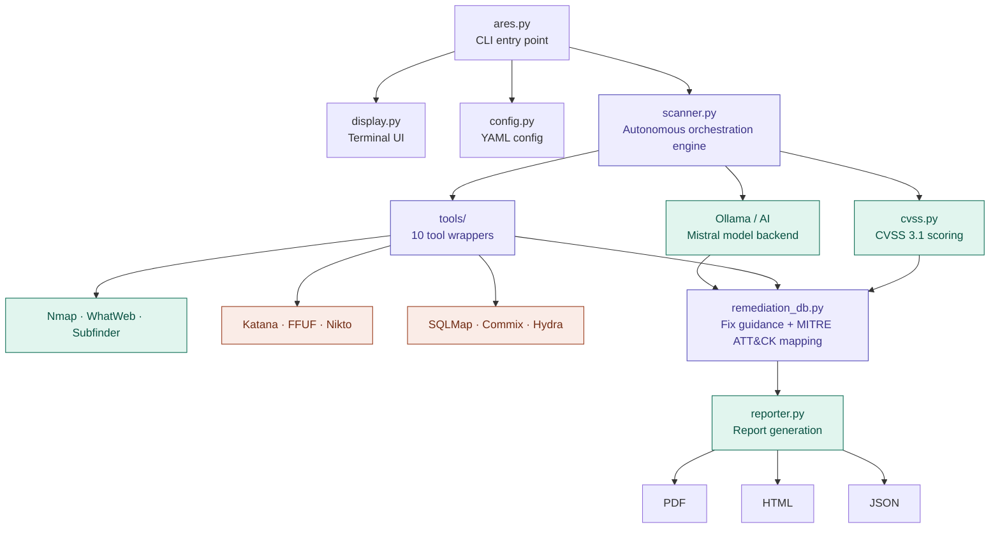

# 🛡️ ARES: Autonomous Recon & Exploitation System


**ARES** is an AI-powered, autonomous penetration testing CLI that orchestrates
industry-standard security tools to perform reconnaissance, vulnerability scanning,
and exploitation — all from your terminal.

> **Developed by [farixzz](https://github.com/farixzz)**

---

## ⚡ Features

### Core Capabilities
- 🤖 **Autonomous Workflow** — AI-driven tool orchestration based on target characteristics
- 📊 **CVSS 3.1 Scoring** — Industry-standard risk assessment with Base + Temporal metrics
- 🔧 **Multi-Tool Integration** — Nmap, Nuclei, SQLMap, Nikto, Katana, and more
- 🛡️ **WAF Detection** — Automatic detection and evasion strategies

### Reporting & Intelligence
- 📄 **Professional Reports** — PDF, HTML, and JSON exports
- 🎯 **Remediation Roadmaps** — Prioritized fix lists with specific commands
- ⚡ **Quick Wins** — Low-effort, high-impact fixes highlighted
- 🗺️ **MITRE ATT&CK Mapping** — Technique IDs for all findings
- 📜 **Compliance Mapping** — PCI-DSS and HIPAA checks

### Scan Profiles
| Profile | Use Case | Duration |
|---------|----------|----------|
| `quick` | Fast surface recon | ~5 min |
| `standard` | Full assessment | ~30 min |
| `deep` | Exploitation mode | 2+ hrs |
| `stealth` | IDS/WAF evasion | ~1 hr |

See [PROFILES.md](./PROFILES.md) for detailed documentation.

---

## 🚀 Installation

### Option A — Local (Recommended)

#### 1. Clone Repository
```bash
git clone https://github.com/farixzz/project-ares.git
cd project-ares
```

#### 2. Setup Virtual Environment
```bash
python3 -m venv venv
source venv/bin/activate
pip install -r requirements.txt
```

#### 3. Install Security Tools

**Automatic (recommended):**
```bash
python ares.py tools --install
```

**Manual — System tools:**
```bash
# Debian / Ubuntu / Kali / Parrot
sudo apt install nmap nikto sqlmap hydra whatweb commix
```

**Manual — Go tools (requires Go 1.19+):**
```bash
go install github.com/projectdiscovery/nuclei/v3/cmd/nuclei@latest
go install github.com/projectdiscovery/subfinder/v2/cmd/subfinder@latest
go install github.com/projectdiscovery/katana/cmd/katana@latest
go install github.com/ffuf/ffuf/v2@latest

export PATH=$PATH:~/go/bin
echo 'export PATH=$PATH:~/go/bin' >> ~/.bashrc
```

#### 4. Setup AI Analysis (Required for full functionality)

ARES uses Ollama to power AI summaries and remediation guidance.
Without it the tool runs in degraded mode with generic output only.
```bash
# Install Ollama
curl -fsSL https://ollama.com/install.sh | sh

# Pull the model
ollama pull mistral

# Start the server
ollama serve
```

Verify it is running:
```bash
curl http://localhost:11434/api/tags
```

#### 5. Verify Installation
```bash
python ares.py tools --check
```

---

### Option B — Docker

ARES ships with a fully self-contained Docker image. All tools are pre-installed.
No local tool setup required.

> **Note:** Ollama must run on your **host machine**. See [Connect Ollama to Docker](#connect-ollama-to-docker) below.

#### Build
```bash
docker build -t project-ares .
```

#### Run
```bash
# Basic scan
docker run -it --rm project-ares scan -t example.com -p standard

# Quick recon
docker run -it --rm project-ares scan -t example.com -p quick --dry-run

# Full pentest
docker run -it --rm project-ares scan -t target.com -p deep

# Stealth mode
docker run -it --rm project-ares scan -t target.com -p stealth
```

#### Persist Reports
```bash
docker run -it --rm \
  -v $(pwd)/reports:/app/ares_results \
  project-ares scan -t example.com -p standard
```

#### Connect Ollama to Docker

Run `ollama serve` on your host first, then:
```bash
# Linux
docker run -it --rm \
  -e OLLAMA_HOST=http://172.17.0.1:11434 \
  -v $(pwd)/reports:/app/ares_results \
  project-ares scan -t example.com -p standard

# macOS / Windows
docker run -it --rm \
  -e OLLAMA_HOST=http://host.docker.internal:11434 \
  -v $(pwd)/reports:/app/ares_results \
  project-ares scan -t example.com -p standard
```

> **Linux tip:** If Ollama only listens on localhost, restart it with:
> `OLLAMA_HOST=0.0.0.0 ollama serve`

#### Verify Tools Inside Container
```bash
docker run --rm project-ares tools --check
```

---

## 📖 Usage

### Basic Scan
```bash
python ares.py scan -t example.com -p standard
```

### Quick Reconnaissance
```bash
python ares.py scan -t example.com -p quick --dry-run
```

### Full Penetration Test
```bash
python ares.py scan -t target.com -p deep
```

### Stealth Mode (IDS/WAF Evasion)
```bash
python ares.py scan -t target.com -p stealth
```

### Batch Scanning
```bash
# From file
python ares.py scan -t targets.txt -p standard

# Comma-separated
python ares.py scan -t "target1.com,target2.com" -p quick
```

### View Reports
```bash
# Open latest report in browser
python ares.py view --latest

# Serve reports over HTTP
python ares.py serve --port 8888
```

### Check Tool Status
```bash
python ares.py tools --check
```

### Configure ARES
```bash
python ares.py config --init
python ares.py config --show
python ares.py config -p deep
```

---

## 📊 Report Features

ARES generates comprehensive reports with:

1. **Executive Summary** — AI-generated business impact analysis
2. **CVSS Scores** — Base + Temporal scoring for each vulnerability
3. **Quick Wins** — High-impact, low-effort fixes with exact commands
4. **Remediation Roadmap** — Prioritized timeline (24hrs → 1 week → 1 month)
5. **Compliance Mapping** — PCI-DSS and HIPAA checks
6. **MITRE ATT&CK** — Technique ID mapping per finding

### Report Formats
| Format | Description |
|--------|-------------|
| **PDF** | Professional printable client-ready reports |
| **HTML** | Interactive browser-based reports |
| **JSON** | Machine-readable for pipeline integration |

---

## 🔧 Tool Integration

| Tool | Purpose | Profiles |
|------|---------|---------|
| Nmap | Port scanning & service detection | All |
| Subfinder | Subdomain enumeration | standard, deep, stealth |
| WhatWeb | Technology fingerprinting | All |
| Katana | Web crawling & endpoint discovery | standard, deep, stealth |
| FFUF | Directory & parameter fuzzing | standard, deep |
| Nuclei | Template-based vulnerability scanning | standard, deep, stealth |
| Nikto | Web server misconfiguration scanning | standard, deep |
| SQLMap | SQL injection detection & exploitation | deep |
| Commix | Command injection exploitation | deep |
| Hydra | Credential brute-forcing | deep |

---

## 🏗️ Architecture

```
project-ares/
├── ares.py                    # Main CLI entry point
├── ares_cli/
│   ├── scanner.py             # Autonomous scanning engine
│   ├── reporter.py            # Multi-format report generation
│   ├── display.py             # Rich terminal UI
│   ├── config.py              # Configuration management
│   ├── cvss.py                # CVSS 3.1 scoring engine
│   ├── remediation_db.py      # Remediation guidance + MITRE mapping
│   └── tools/
│       ├── enhanced_tool_manager.py
│       ├── nuclei_scanner.py
│       ├── katana_crawler.py
│       ├── ffuf_fuzzer.py
│       ├── subdomain_enum.py
│       └── whatweb_fingerprint.py
├── tests/
├── PROFILES.md
├── CHANGELOG.md
├── requirements.txt
└── Dockerfile
```

---

## ⚙️ Configuration

Initialize config:
```bash
python ares.py config --init
```

Location: `~/.config/ares/config.yaml`
```yaml
# AI Configuration
ollama_host: http://localhost:11434
ollama_model: mistral
enable_ai_analysis: true

# Reporting
report_author: "Security Team"
company_name: "Your Company"
enable_compliance_check: true

# Output
output_dir: ./ares_results
```

### Environment Variables (Docker)
| Variable | Default | Description |
|----------|---------|-------------|
| `OLLAMA_HOST` | `http://host.docker.internal:11434` | Ollama server address |

---

## 🔍 Troubleshooting

### AI analysis not working
```
[!] WARNING: OLLAMA NOT REACHABLE — AI analysis is DISABLED
```
Run `ollama serve` on your host. Docker users: pass
`-e OLLAMA_HOST=http://172.17.0.1:11434` (Linux) or
`-e OLLAMA_HOST=http://host.docker.internal:11434` (macOS/Windows).

### Nuclei finding nothing
```bash
nuclei -update-templates
nuclei -target https://example.com -severity critical,high -silent
```

### Go tools not found after install
```bash
export PATH=$PATH:~/go/bin
echo 'export PATH=$PATH:~/go/bin' >> ~/.bashrc
source ~/.bashrc
```

### Permission denied on Nmap
```bash
sudo python ares.py scan -t target.com -p standard
```

### Ollama unreachable from Docker on Linux
```bash
# Restart Ollama bound to all interfaces
pkill ollama
OLLAMA_HOST=0.0.0.0 ollama serve
```

---

## ⚖️ Legal Disclaimer

**ARES is intended for authorized security testing only.**

- Only scan systems you have **explicit written permission** to test
- Obtain authorization before any assessment
- The developer assumes **no liability** for misuse
- Use responsibly and ethically

---

## 🤝 Contributing

1. Fork the repository
2. Create a feature branch: `git checkout -b feature/awesome`
3. Commit changes: `git commit -m 'Add awesome feature'`
4. Push: `git push origin feature/awesome`
5. Open a Pull Request

---

## 📋 Changelog

See [CHANGELOG.md](./CHANGELOG.md) for full version history.

---

## 📝 License

MIT License — See [LICENSE](LICENSE) for details.

---

**Made with 💀 by [farixzz](https://github.com/farixzz)**
