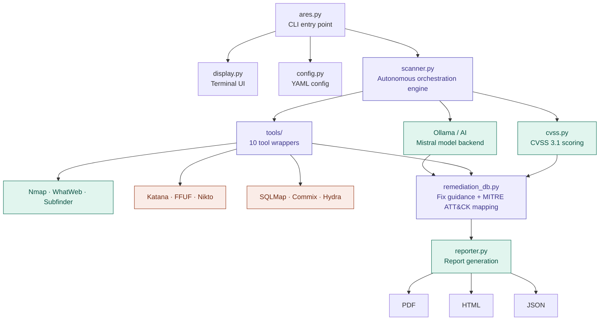

# 🛡️ ARES: Autonomous Recon & Exploitation System


**ARES** is an AI-powered, autonomous penetration testing CLI that orchestrates industry-standard security tools to perform reconnaissance, vulnerability scanning, and exploitation—all from your terminal.

> **Developed by [farixzz](https://github.com/farixzz)**

---

## ⚡ Features

### Core Capabilities
- 🤖 **Autonomous Workflow** - AI-driven tool orchestration based on target characteristics
- 📊 **CVSS 3.1 Scoring** - Industry-standard risk assessment with Base + Temporal metrics
- 🔧 **Multi-Tool Integration** - Nmap, Nuclei, SQLMap, Nikto, Katana, and more
- 🛡️ **WAF Detection** - Automatic detection and evasion strategies

### Reporting & Intelligence
- 📄 **Professional Reports** - PDF, HTML, and JSON exports
- 🎯 **Remediation Roadmaps** - Prioritized fix lists with specific commands
- ⚡ **Quick Wins** - Low-effort, high-impact fixes highlighted
- 🗺️ **MITRE ATT&CK Mapping** - Technique IDs for all findings

### Scan Profiles
| Profile | Use Case | Duration |
|---------|----------|----------|
| `quick` | Fast recon | ~5 min |
| `standard` | Regular pentests | ~30 min |
| `deep` | Full exploitation | 2+ hrs |
| `stealth` | IDS/WAF evasion | ~1 hr |

See [PROFILES.md](./PROFILES.md) for detailed documentation.

---

## 🚀 Installation

### 1. Clone Repository
```bash
git clone https://github.com/farixzz/project-ares.git
cd ares-cli
```

### 2. Setup Virtual Environment
```bash
python3 -m venv venv
source venv/bin/activate
pip install -r requirements.txt
```

### 3. Install Security Tools

**Automatic (recommended):**
```bash
python ares.py tools --install
```

**Manual:**
```bash
# Debian/Ubuntu
sudo apt install nmap nikto sqlmap whatweb

# Go tools (requires Go 1.19+)
go install github.com/projectdiscovery/nuclei/v3/cmd/nuclei@latest
go install github.com/projectdiscovery/subfinder/v2/cmd/subfinder@latest
go install github.com/projectdiscovery/katana/cmd/katana@latest
go install github.com/ffuf/ffuf/v2@latest

# Add Go bin to PATH
export PATH=$PATH:~/go/bin
```

### 4. Verify Installation
```bash
python ares.py tools --check
```

---

## 📖 Usage

### Basic Scan
```bash
python ares.py scan -t example.com -p standard
```

### Quick Reconnaissance
```bash
python ares.py scan -t example.com -p quick --dry-run
```

### Full Penetration Test
```bash
python ares.py scan -t target.com -p deep
```

### Stealth Mode (IDS/WAF Evasion)
```bash
python ares.py scan -t target.com -p stealth
```

### Batch Scanning
```bash
# From file
python ares.py scan -t targets.txt -p standard

# Comma-separated
python ares.py scan -t "target1.com,target2.com" -p quick
```

### View Reports
```bash
# Open latest report in browser
python ares.py view --latest

# Serve reports over HTTP
python ares.py serve --port 8888
```

### Check Tool Status
```bash
python ares.py tools --check
```

### Configure ARES
```bash
python ares.py config --init
python ares.py config --show
python ares.py config -p deep  # View profile details
```

---

## 📊 Report Features

ARES generates comprehensive reports with:

1. **Executive Summary** - AI-generated business impact analysis
2. **CVSS Scores** - Base + Temporal scoring for each vulnerability
3. **Quick Wins** - High-impact, low-effort fixes with commands
4. **Remediation Roadmap** - Prioritized timeline (24hrs → 1 week → 1 month)
5. **Compliance Mapping** - PCI-DSS and HIPAA checks
6. **MITRE ATT&CK** - Technique ID mapping

### Report Formats
- **PDF** - Professional printable reports
- **HTML** - Interactive web-based reports
- **JSON** - Machine-readable for integration

---

## 🔧 Tool Integration

| Tool | Purpose | Profile |
|------|---------|---------|
| Nmap | Port scanning & service detection | All |
| Subfinder | Subdomain enumeration | standard, deep, stealth |
| WhatWeb | Technology fingerprinting | All |
| Katana | Web crawling | standard, deep, stealth |
| FFUF | Directory fuzzing | standard, deep |
| Nuclei | Vulnerability scanning | standard, deep, stealth |
| Nikto | Web server scanning | deep |
| SQLMap | SQL injection exploitation | deep |
| Commix | Command injection exploitation | deep |
| Hydra | Credential brute-forcing | deep |

---

## 🏗️ Architecture



```
ares-cli/
├── ares.py              # Main CLI entry point
├── ares_cli/
│   ├── scanner.py      # Autonomous scanning engine
│   ├── reporter.py     # Multi-format report generation
│   ├── display.py      # Rich terminal UI
│   ├── config.py       # Configuration management
│   ├── cvss.py         # CVSS 3.1 scoring engine
│   ├── remediation_db.py # Remediation guidance
│   └── tools/          # Tool wrappers
├── PROFILES.md         # Profile documentation
├── requirements.txt    # Python dependencies
└── Dockerfile          # Container deployment
```

---

## 🐳 Docker Deployment

```bash
# Build
docker build -t ares-cli .

# Run
docker run -it --rm ares-cli scan -t example.com -p standard

# With volume for reports
docker run -it --rm -v ./reports:/app/ares_results ares-cli scan -t example.com
```

---

## ⚙️ Configuration

Initialize config:
```bash
python ares.py config --init
```

Location: `~/.config/ares/config.yaml`

```yaml
# AI Configuration
ollama_host: http://localhost:11434
ollama_model: mistral
enable_ai_analysis: true

# Reporting
report_author: "Security Team"
company_name: "Your Company"
enable_compliance_check: true
```

---

## ⚖️ Legal Disclaimer

**ARES is intended for authorized security testing only.**

- Only scan systems you have explicit permission to test
- Obtain written authorization before any assessment
- The developer assumes no liability for misuse
- Use responsibly and ethically

---

## 🤝 Contributing

1. Fork the repository
2. Create a feature branch: `git checkout -b feature/awesome`
3. Commit changes: `git commit -m 'Add awesome feature'`
4. Push: `git push origin feature/awesome`
5. Open a Pull Request

---

## 📝 License

MIT License - See [LICENSE](LICENSE) for details.

---

**Made with 💀 by [farixzz](https://github.com/farixzz)**
